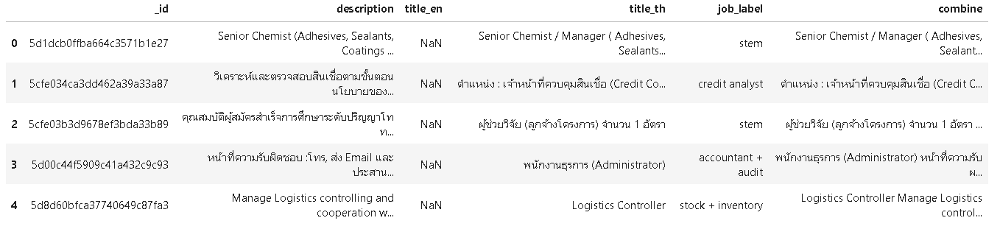
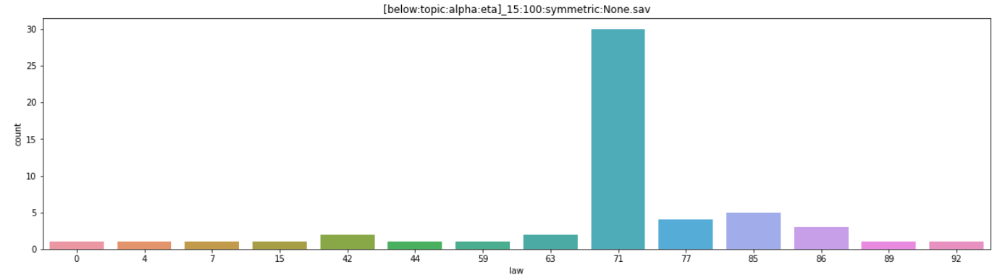
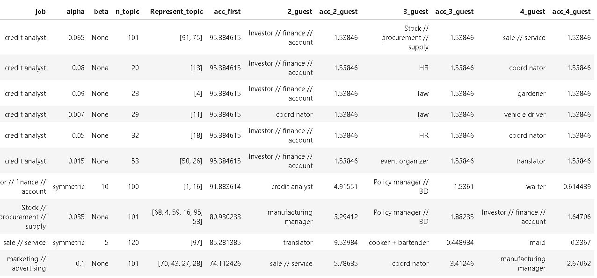
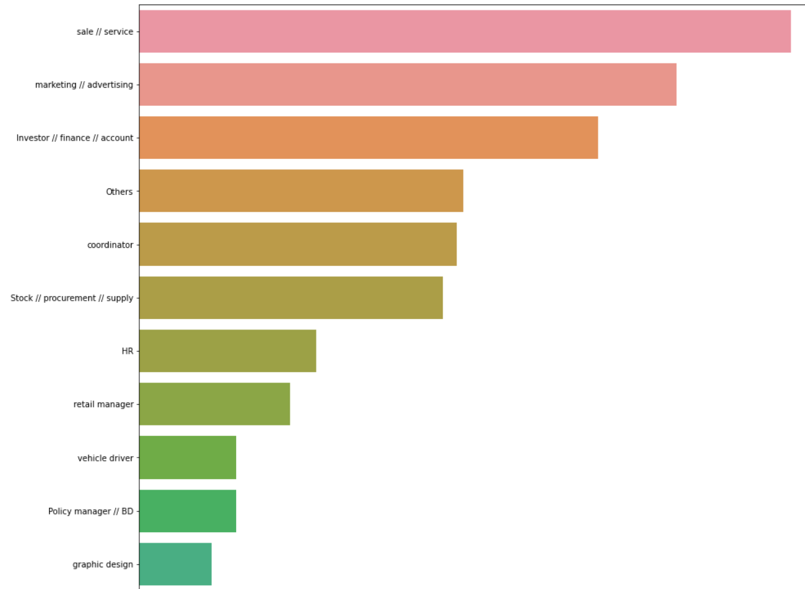
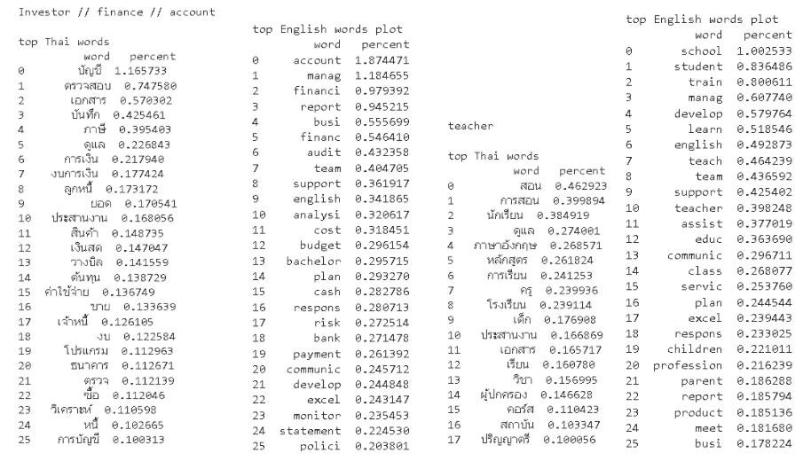
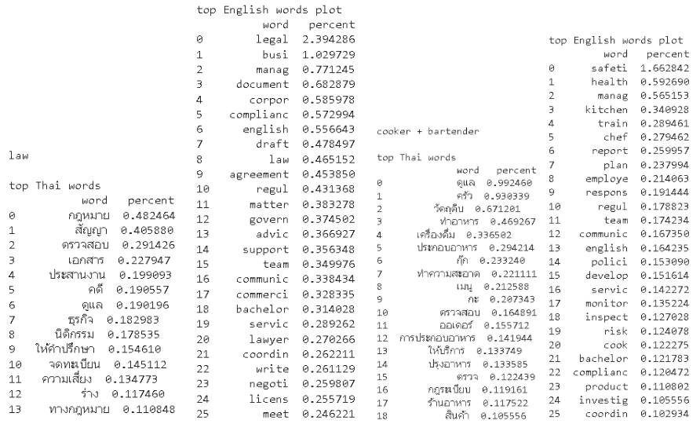
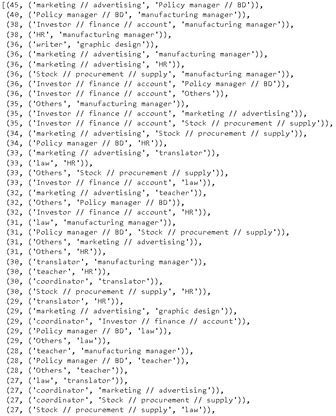

# Semi-supervised-NLP-Latent-Dirichlet-Allocation (LDA)
Thailand Development Research Institute (TDRI)| Feb 2021 - April 2021

Education reform policy and sustainable development policy department

***Objective:***
1. Query more than 1 million job descriptions (English and Thai) from MongoDB, an unstructured database, and preprocess them with Gensim and NLTK (stem, lemmatize, stop words removal and corpus filtering based on word frequency)
2. Classify jobs from their descriptions (TF-IDF word vectors) using fine-tined Latent Dirichlet Allocation, semi-unsupervised NLP topic modeling, with customized evaluation metrics
3. Deploy models and make a big impact on defining [Thai education policy](https://tdri.or.th/en/2021/12/meeting-new-job-demands-in-the-post-covid-economy/) by visualizing and analyzing job distributions as well as defining skills necessary in the future job market trend for newer Thai generations in the post-Covid economy

## 1. Preparing test and train dataset
### 1.1 Query non-STEM jobs from MongoDB and test the LDA algorithm

          Data schema

          Result table

          LDA model

***Link to the code:*** [Query non-STEM and LDA testing](https://github.com/saeth40/Unsupervised-NLP-Latent-Dirichlet-Allocation/blob/main/Preparing%20test%20and%20train%20dataset/Query_non_STEM_plus_LDAtesting.ipynb).

### 1.2 Shuffle selected data and split it to test (5,000) and train (the rest)

***Link to the code:*** [Split test train](https://github.com/saeth40/Unsupervised-NLP-Latent-Dirichlet-Allocation/blob/main/Preparing%20test%20and%20train%20dataset/Shuffle_5000.py).

### 1.3 Divide test dataset into 10 files allocated to members to label job titles

          Mapping from numbers to job titles

          Sample of a labeled table

***Link to the code:*** [Preparing test dataset to label](https://github.com/saeth40/Unsupervised-NLP-Latent-Dirichlet-Allocation/blob/main/Preparing%20test%20and%20train%20dataset/Dividing_500.py)

### 1.4 Combine job description with job title into a 'combine' column, and map numbers to job titles

***Link to the code:*** [Combine and map test dataset](https://github.com/saeth40/Unsupervised-NLP-Latent-Dirichlet-Allocation/blob/main/Preparing%20test%20and%20train%20dataset/CombineDescriptionWithTitle_And_Mapping.py)

### 1.5 Preprocess a dictionary of the train dataset
1. without bigram and trigram.

      ***Link to the code:*** [Dictionary without Bi, Tri gram](https://github.com/saeth40/Unsupervised-NLP-Latent-Dirichlet-Allocation/blob/main/Preparing%20test%20and%20train%20dataset/DictionryWithoutBiTri.py)

2. with bigram and trigram.

      ***Link to the code:*** [Dictionary with Bi, Tri gram](https://github.com/saeth40/Unsupervised-NLP-Latent-Dirichlet-Allocation/blob/main/Preparing%20test%20and%20train%20dataset/DictionryWithBiTri.py)

## 2. Training LDA models
          Filter dictionary

**Parameters variation:**
1. keep_n = [50000, 75000, 100000, 150000, 175000, 200000]
2. no_below = [5,10, 15, 20, 25, 30, 35, 40 ,45, 50]
3. no_above = [0.1, 0.3, 0.5, 0.7, 0.9]

          Train the model

**Parameters variation:**
1. num_topics = 1 to 120
2. alpha (the higher, the more each document contains more topics) = 0.001 to 0.1 (increase by 0.001) + 'symmetric'
3. eta (the higher, the more each topic contains more words) = 0.01 to 10 (increase by 0.01) + 'None'

***Link to the code:*** [Training LDA models](https://github.com/saeth40/Unsupervised-NLP-Latent-Dirichlet-Allocation/blob/main/Training%20LDA%20models/LDA_training.py)

## 3. Models evaluation
### 3.1 results of all models (each tuple is a topic No)

***Link to the code:*** [Raw test results](https://github.com/saeth40/Unsupervised-NLP-Latent-Dirichlet-Allocation/blob/main/Models%20evaluation/Raw_test_result.py)

### 3.2 Topic representatoin of each model

***Link to the code:*** [Topic representatoin](https://github.com/saeth40/Unsupervised-NLP-Latent-Dirichlet-Allocation/blob/main/Models%20evaluation/Test_result_error_jobName_tagNo.py)

### 3.3 Mapping topic numbers to job names

***Link to the code:*** [Topic numbers to job names](https://github.com/saeth40/Unsupervised-NLP-Latent-Dirichlet-Allocation/blob/main/Models%20evaluation/Test_result_error_jobName_tagNo.py)

### 3.4 Error results

***Link to the code:*** [Error results](https://github.com/saeth40/Unsupervised-NLP-Latent-Dirichlet-Allocation/blob/main/Models%20evaluation/Test_result_error_jobName_tagNo.py)

## 4. Analyze test results
### 4.1 Topic plot for each job

***Link to the code:*** [Topic plot per job](https://github.com/saeth40/Unsupervised-NLP-Latent-Dirichlet-Allocation/blob/main/Analyze%20test%20results/Topic_plot_for_each_job.ipynb)

### 4.2 Topic distribution with many jobs

***Link to the code:*** [Topic plot per job](https://github.com/saeth40/Unsupervised-NLP-Latent-Dirichlet-Allocation/blob/main/Analyze%20test%20results/Jobs_plot_for_each_model.ipynb)

### 4.3 one job plot with many models

***Link to the code:*** [Topic plot per job](https://github.com/saeth40/Unsupervised-NLP-Latent-Dirichlet-Allocation/blob/main/Analyze%20test%20results/1job_plot_for_all_models.ipynb)

### 4.4 Hyperparameters plot

          alpha vs error

          Beta vs error

***Link to the code:*** [Hyperparameters plot](https://github.com/saeth40/Unsupervised-NLP-Latent-Dirichlet-Allocation/blob/main/Analyze%20test%20results/Hyperparameters_plot.ipynb)

### 4.5 Models' guessing results (all possible guessing and their error)

***Link to the code:*** [Guessing results](https://github.com/saeth40/Unsupervised-NLP-Latent-Dirichlet-Allocation/blob/main/Analyze%20test%20results/Guessing_errors.ipynb)

## 5. Fine tune dictionary
### 5.1 List all words of each job and drop the low-frequency words

***Link to the code:*** [All words for each job](https://github.com/saeth40/Unsupervised-NLP-Latent-Dirichlet-Allocation/blob/main/Fine%20tune%20dictionary/All_words_with_threshold_of_each_job.py)

### 5.2 Filter dictonary by eliminating words with 'N' from 'YorN' column

***Link to the code:*** [Y or N filter dictionary](https://github.com/saeth40/Unsupervised-NLP-Latent-Dirichlet-Allocation/blob/main/Fine%20tune%20dictionary/All_words_YorN.py)

***Note that after this, the process iterates from 3 to 5 until reaching the desired results.***

## 6. Models selection
### 6.1 Analyze the first guess until the fourth guess of each model with their confidence scores

***Link to the code:*** [First to fourth guess](https://github.com/saeth40/Unsupervised-NLP-Latent-Dirichlet-Allocation/blob/main/Models%20selection/FirstGuess_SecondGuess.ipynb)

### 6.2 Choose models that have accuracy (identify the right topic) higher than threshold (i.e. 70, 75, 80) and the errors of misguessing (identify the wrong topic) is lower than threshold (i.e. 20, 15, 10)

***Link to the code:*** [Models selection with threshold](https://github.com/saeth40/Unsupervised-NLP-Latent-Dirichlet-Allocation/blob/main/Models%20selection/Model_Selection_Threshold.py)

### 6.3 Choose models from 6.2 to have only 1 model per job based on score = (acc - avg_acc)*1.5 - (err - avg_err)*1

***Note that, avg_acc and avg_err are the average values of candidates (models) with a specific job e.g. HR. Acc and err are the value of the selected candidate.***

***Link to the code:*** [Models selection based on score](https://github.com/saeth40/Unsupervised-NLP-Latent-Dirichlet-Allocation/blob/main/Models%20selection/Model_Selection_Score.py)

## 7. Models pipeline and depoly models
### 7.1 Deploy models in 'order' column of [Model pipeline order.csv](https://github.com/saeth40/Unsupervised-NLP-Latent-Dirichlet-Allocation/blob/main/Models%20pipeline%20and%20depoly%20models/Model_pipeline_order.csv)

***Link to the code:*** [Deploy models](https://github.com/saeth40/Unsupervised-NLP-Latent-Dirichlet-Allocation/blob/main/Models%20pipeline%20and%20depoly%20models/Deploy_model.ipynb)

### 7.2 Test models in real dataset

***Link to the code:*** [Test models](https://github.com/saeth40/Unsupervised-NLP-Latent-Dirichlet-Allocation/blob/main/Models%20pipeline%20and%20depoly%20models/Test_models.ipynb)

## 8. Insights and findings
### 8.1 Jobs distribution

***Full result:*** [Jobs distribution](https://github.com/saeth40/Unsupervised-NLP-Latent-Dirichlet-Allocation/blob/main/Insights%20and%20findings/Jobs_Distribution.ipynb)

### 8.2 Top skills in each job (Thai and English)

***Full result:*** [Jobs' top skills](https://github.com/saeth40/Unsupervised-NLP-Latent-Dirichlet-Allocation/blob/main/Insights%20and%20findings/Skills_in_each_job_and_similarity.ipynb)

### 8.3 Jobs' similarity

***Full result:*** [Jobs' similarity](https://github.com/saeth40/Unsupervised-NLP-Latent-Dirichlet-Allocation/blob/main/Insights%20and%20findings/Skills_in_each_job_and_similarity.ipynb)
